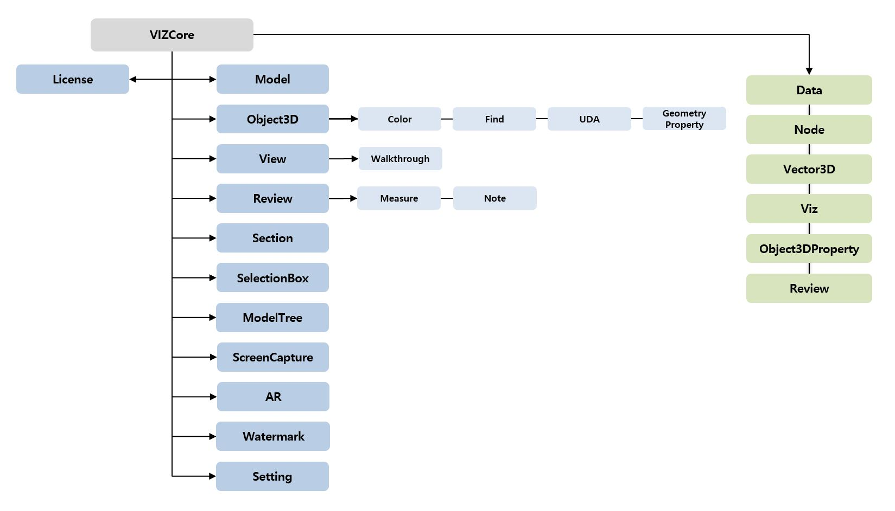

# VIZWing
SOFTHILLS Mobile 3D Visualization

모바일 시각화 엔진인 VIZCore.aar 제품(컨트롤)에 대한 기본 사용 예제 및 활용 코드를 공유하기 위한 목적입니다.

상세 API에 대한 설명 및 예제는 SHDC (https://www.softhills.net/SHDC) 를 참고 하시기 바랍니다.
***

## 디렉토리 설명
| 구분  | 설명 | 비고 |
| ------------- | ------------- | ------------- |
| VIZWingBasic | 모델 뷰어 기본 화면 | 기본 뷰어 화면 |
***

## Gallery
##### COMPONENT DIAGRAM

***

## 문의
## 기술지원 : tech@softhills.net
## 구매문의 : sales@softhills.net
***

## Resources

+ **Website:** [www.softhills.net](https://www.softhills.net)
+ **Documentation:** [VIZCore Documentation](https://www.softhills.net/SHDC)
